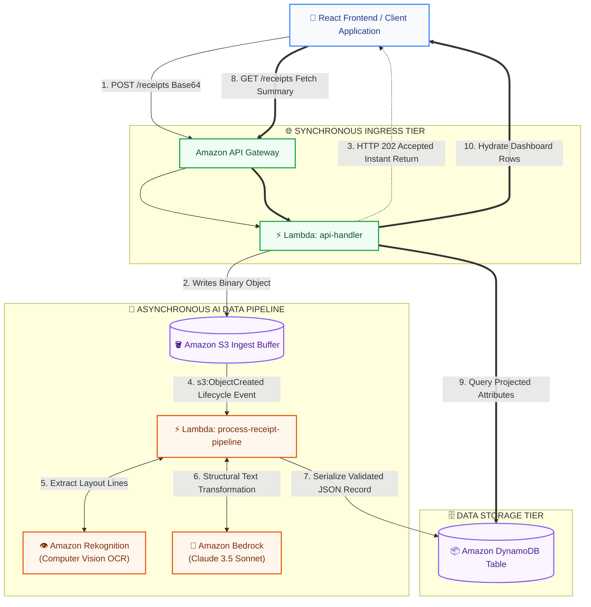

## Description 

This project is a **Serverless AI Receipt Data Pipeline** engineered to automate the ingestion, extraction, and semantic structuring of unstructured real-world financial documents. 
 
This platform solves that limitation by implementing an **Asynchronously Decoupled Microservices Pattern**:
1. **The Ingress Ingestion Engine** captures raw multi-modal receipt uploads via a public REST API endpoint managed by Amazon API Gateway and instantly saves them to an object storage buffer.
2. **The Background AI Processing Engine** wakes up automatically via event-driven cloud triggers. It orchestrates **Amazon Rekognition** to execute spatial layout Optical Character Recognition (OCR) before passing the raw unstructured text strings to **Amazon Bedrock (Anthropic Claude 4.6 Sonnet)**.
3. **The LLM Parser** analyzes the chaotic text layout, performs real-time financial data mapping, and serializes the parsed values into a highly organized, type-safe JSON contract.
4. **The Persistence Layer** runs defensive data-sanitization scripts to format the response into a validation-compliant layout, storing the clean metrics securely inside a distributed **Amazon DynamoDB NoSQL database** for rapid frontend dashboard rendering.

The entire cloud ecosystem is 100% serverless, executing on-demand with fine-grained IAM security boundaries, and costing exactly **$0.00 in maintenance overhead when completely inactive**.

## Tech Stack 
- Compute / Microservices: AWS Lambda
- Web API Engine: Amazon API Gateway 
- Object Storage: Amazon S3 
- AI & Computer Vision: Amazon Bedrock, Amazon Rekognition
- Database Management: Amazon DynamoDB

## Architecture Diagram

